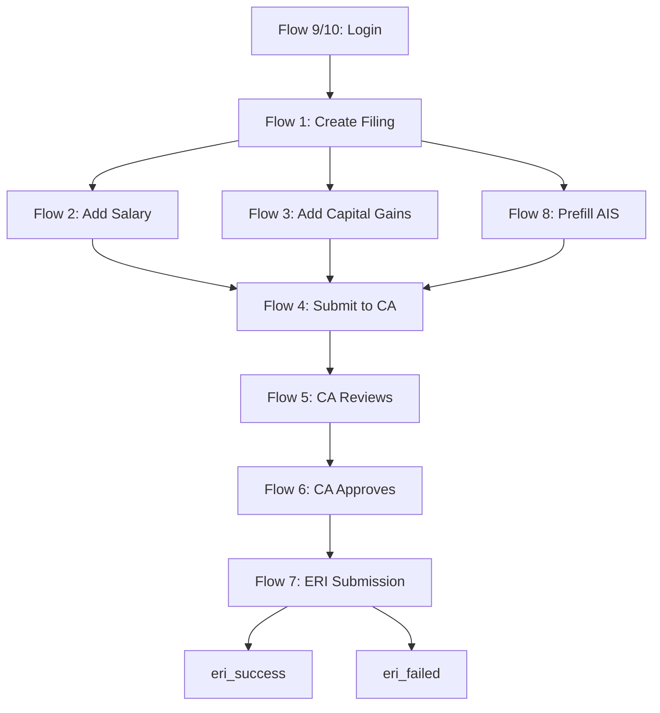

# Developer Entry Points & Flow Navigation
**S13 - System Visibility & Control Reset**  
**Last Updated:** 2026-01-04  
**Purpose:** Navigate the codebase by user flows, not file structure

---

## 🎯 Quick Navigation

**Don't search the repo — use this guide.**

Each flow below shows:
1. **HTTP Endpoint** → What the user calls
2. **Route Handler** → Where the request lands
3. **Service Chain** → What services are orchestrated
4. **State Changes** → What gets mutated
5. **Audit Trail** → What gets logged

---

## 🔵 Core Filing Flows

### Flow 1: User Creates a New Filing

**User Action:** "Start a new ITR filing"

```
POST /api/filings
↓
routes/filing.js → POST /
↓
FilingService.createFiling({ assessmentYear, taxpayerPan }, user)
↓
ITRFiling.create({
  createdBy: user.userId,
  caFirmId: user.caFirmId,
  assessmentYear,
  taxpayerPan,
  lifecycleState: 'draft',  // Initial state
})
↓
[Audit] Filing created (logged in FilingService)
```

**Files Touched:**
- [routes/filing.js](file:///e:/Burnblack/bbofficial/backend/src/routes/filing.js) — Route handler
- [services/core/FilingService.js](file:///e:/Burnblack/bbofficial/backend/src/services/core/FilingService.js) — Orchestrator
- [models/ITRFiling.js](file:///e:/Burnblack/bbofficial/backend/src/models/ITRFiling.js) — Data model

**State Changes:**
- ✅ Creates `ITRFiling` record with `lifecycleState: 'draft'`

**Audit Events:**
- 📝 `enterpriseLogger.info('Filing created', { filingId, userId, assessmentYear })`

---

### Flow 2: User Adds Salary Data

**User Action:** "Add employer salary details"

```
POST /api/filings/:filingId/employers
↓
routes/employer.js → POST /:filingId/employers
↓
EmployerManagementService.addEmployer(filingId, employerData)
↓
1. Fetch ITRFiling
2. Update jsonPayload.employers[]
3. Save ITRFiling
↓
[Audit] Employer added (TODO: Add structured logging)
```

**Files Touched:**
- [routes/employer.js](file:///e:/Burnblack/bbofficial/backend/src/routes/employer.js) — Route handler
- [services/itr/EmployerManagementService.js](file:///e:/Burnblack/bbofficial/backend/src/services/itr/EmployerManagementService.js) — Domain service
- [models/ITRFiling.js](file:///e:/Burnblack/bbofficial/backend/src/models/ITRFiling.js) — Data model

**State Changes:**
- ✅ Mutates `ITRFiling.jsonPayload.employers[]`
- ❌ Does NOT change `lifecycleState`

**Audit Events:**
- 📝 TODO: Add structured logging for employer mutations

---

### Flow 3: User Adds Capital Gains

**User Action:** "Add a capital gains transaction"

```
POST /api/filings/:filingId/capital-gains
↓
routes/capitalGains.js → POST /:filingId/capital-gains
↓
CapitalGainsSummaryService.addTransaction(filingId, transactionData)
↓
1. Fetch ITRFiling
2. Update jsonPayload.capitalGains[]
3. Recalculate summary
4. Save ITRFiling
↓
[Audit] Capital gains transaction added (TODO: Add structured logging)
```

**Files Touched:**
- [routes/capitalGains.js](file:///e:/Burnblack/bbofficial/backend/src/routes/capitalGains.js) — Route handler
- [services/itr/CapitalGainsSummaryService.js](file:///e:/Burnblack/bbofficial/backend/src/services/itr/CapitalGainsSummaryService.js) — Domain service
- [models/ITRFiling.js](file:///e:/Burnblack/bbofficial/backend/src/models/ITRFiling.js) — Data model

**State Changes:**
- ✅ Mutates `ITRFiling.jsonPayload.capitalGains[]`
- ❌ Does NOT change `lifecycleState`

**Audit Events:**
- 📝 TODO: Add structured logging for CG mutations

---

## 🟢 Review & Approval Flows

### Flow 4: User Submits Filing to CA

**User Action:** "Submit my filing for CA review"

```
POST /api/filings/:filingId/submit-to-ca
↓
routes/filing.js → POST /:filingId/submit-to-ca
↓
CAApprovalService.submitToCA(filingId, userId)
↓
1. Fetch ITRFiling
2. Check for blocking CA requests
3. SubmissionStateMachine.transition(filing, 'review_pending')
4. Save ITRFiling
5. AuditService.logTransition(...)
↓
[State] draft → review_pending
[Audit] State transition logged
```

**Files Touched:**
- [routes/filing.js](file:///e:/Burnblack/bbofficial/backend/src/routes/filing.js) — Route handler
- [services/ca/CAApprovalService.js](file:///e:/Burnblack/bbofficial/backend/src/services/ca/CAApprovalService.js) — Orchestrator
- [domain/SubmissionStateMachine.js](file:///e:/Burnblack/bbofficial/backend/src/domain/SubmissionStateMachine.js) — State enforcer
- [services/core/AuditService.js](file:///e:/Burnblack/bbofficial/backend/src/services/core/AuditService.js) — Audit logger

**State Changes:**
- ✅ `lifecycleState: 'draft'` → `'review_pending'`

**Audit Events:**
- 📝 `AuditService.logTransition(filingId, 'draft', 'review_pending', userId, 'USER', transaction)`

---

### Flow 5: CA Reviews Filing

**User Action:** "CA marks filing as reviewed"

```
POST /api/ca/filings/:filingId/review
↓
routes/ca.js → POST /filings/:filingId/review
↓
FilingReviewService.markAsReviewed(filingId, caUser, reviewNotes)
↓
1. Fetch ITRFiling
2. Validate CA has access (same firm)
3. SubmissionStateMachine.transition(filing, 'reviewed')
4. Set reviewedBy, reviewedAt, reviewNotes
5. Save ITRFiling
6. AuditService.logTransition(...)
↓
[State] review_pending → reviewed
[Audit] State transition + review metadata logged
```

**Files Touched:**
- [routes/ca.js](file:///e:/Burnblack/bbofficial/backend/src/routes/ca.js) — Route handler
- [services/ca/FilingReviewService.js](file:///e:/Burnblack/bbofficial/backend/src/services/ca/FilingReviewService.js) — Review orchestrator
- [domain/SubmissionStateMachine.js](file:///e:/Burnblack/bbofficial/backend/src/domain/SubmissionStateMachine.js) — State enforcer
- [services/core/AuditService.js](file:///e:/Burnblack/bbofficial/backend/src/services/core/AuditService.js) — Audit logger

**State Changes:**
- ✅ `lifecycleState: 'review_pending'` → `'reviewed'`
- ✅ Sets `reviewedBy`, `reviewedAt`, `reviewNotes`

**Audit Events:**
- 📝 `AuditService.logTransition(filingId, 'review_pending', 'reviewed', caUserId, 'CA', transaction)`

---

### Flow 6: CA Approves & Submits to ITD

**User Action:** "CA approves filing and submits to Income Tax Department"

```
POST /api/ca/filings/:filingId/submit-to-itd
↓
routes/ca.js → POST /filings/:filingId/submit-to-itd
↓
CAApprovalService.submitToITD(filingId, caUser)
↓
1. Fetch ITRFiling
2. Validate CA firm access
3. SubmissionStateMachine.transition(filing, 'approved')
4. AuditService.logTransition(..., 'approved')
5. SubmissionStateMachine.transition(filing, 'submitted_to_eri')
6. AuditService.logTransition(..., 'submitted_to_eri')
7. Save ITRFiling
8. Trigger SubmissionWorker.processSubmission(filingId) (async)
↓
[State] reviewed → approved → submitted_to_eri
[Background] SubmissionWorker starts ERI submission
```

**Files Touched:**
- [routes/ca.js](file:///e:/Burnblack/bbofficial/backend/src/routes/ca.js) — Route handler
- [services/ca/CAApprovalService.js](file:///e:/Burnblack/bbofficial/backend/src/services/ca/CAApprovalService.js) — Approval orchestrator
- [domain/SubmissionStateMachine.js](file:///e:/Burnblack/bbofficial/backend/src/domain/SubmissionStateMachine.js) — State enforcer
- [workers/SubmissionWorker.js](file:///e:/Burnblack/bbofficial/backend/src/workers/SubmissionWorker.js) — Background worker
- [services/core/AuditService.js](file:///e:/Burnblack/bbofficial/backend/src/services/core/AuditService.js) — Audit logger

**State Changes:**
- ✅ `lifecycleState: 'reviewed'` → `'approved'` → `'submitted_to_eri'`
- ✅ Sets `approvedBy`, `approvedAt`, `approvalNotes`

**Audit Events:**
- 📝 Two state transitions logged
- 📝 Background worker execution (logged in worker)

---

## 🟡 External Integration Flows

### Flow 7: ERI Submission (Background)

**Trigger:** `SubmissionWorker.processSubmission(filingId)` (async)

```
SubmissionWorker.processSubmission(filingId)
↓
1. Fetch ITRFiling
2. Build ITR XML via ITRJsonBuilders
3. ERIGatewayService.submitToERI(xml, filingId)
   ↓
   3a. Sign XML with DSC (eriSigningService)
   3b. POST to ITD ERI endpoint
   3c. Receive acknowledgment
↓
4. If success:
   SubmissionStateMachine.transition(filing, 'eri_success')
   AuditService.logTransition(..., 'eri_success')
↓
5. If failure:
   SubmissionStateMachine.transition(filing, 'eri_failed')
   AuditService.logTransition(..., 'eri_failed')
↓
6. Save ITRFiling
↓
[State] submitted_to_eri → eri_success OR eri_failed
[Audit] Final state transition logged
```

**Files Touched:**
- [workers/SubmissionWorker.js](file:///e:/Burnblack/bbofficial/backend/src/workers/SubmissionWorker.js) — Worker orchestrator
- [services/eri/ERIGatewayService.js](file:///e:/Burnblack/bbofficial/backend/src/services/eri/ERIGatewayService.js) — ERI integration
- [services/eri/eriSigningService.js](file:///e:/Burnblack/bbofficial/backend/src/services/eri/eriSigningService.js) — DSC signing
- [services/itr/ITRJsonBuilders.js](file:///e:/Burnblack/bbofficial/backend/src/services/itr/ITRJsonBuilders.js) — XML generation
- [domain/SubmissionStateMachine.js](file:///e:/Burnblack/bbofficial/backend/src/domain/SubmissionStateMachine.js) — State enforcer

**State Changes:**
- ✅ `lifecycleState: 'submitted_to_eri'` → `'eri_success'` OR `'eri_failed'`

**Audit Events:**
- 📝 State transition logged
- 📝 ERI response metadata logged

---

### Flow 8: AIS Data Prefill

**User Action:** "Prefill my filing with AIS data"

```
POST /api/filings/:filingId/prefill-ais
↓
routes/filing.js → POST /:filingId/prefill-ais
↓
ITRDataPrefetchService.prefillFromAIS(filingId, userId)
↓
1. Fetch ITRFiling
2. AISService.fetchAISData(pan, assessmentYear)
   ↓
   2a. Call ITD AIS API
   2b. Parse response
↓
3. Map AIS data to jsonPayload structure
4. Update ITRFiling.jsonPayload (employers, interest, dividends, etc.)
5. Save ITRFiling
↓
[Data] jsonPayload populated with AIS data
[Audit] AIS prefill logged (TODO: Add structured logging)
```

**Files Touched:**
- [routes/filing.js](file:///e:/Burnblack/bbofficial/backend/src/routes/filing.js) — Route handler
- [services/itr/ITRDataPrefetchService.js](file:///e:/Burnblack/bbofficial/backend/src/services/itr/ITRDataPrefetchService.js) — Prefill orchestrator
- [services/integration/AISService.js](file:///e:/Burnblack/bbofficial/backend/src/services/integration/AISService.js) — External API
- [models/ITRFiling.js](file:///e:/Burnblack/bbofficial/backend/src/models/ITRFiling.js) — Data model

**State Changes:**
- ✅ Mutates `ITRFiling.jsonPayload` (multiple sections)
- ❌ Does NOT change `lifecycleState`

**Audit Events:**
- 📝 TODO: Add structured logging for AIS prefill

---

## 🔐 Authentication Flows

### Flow 9: User Logs In (Local)

**User Action:** "Log in with email and password"

```
POST /api/auth/login
↓
routes/auth.js → POST /login
↓
AuthService.login(email, password)
↓
1. User.findByEmail(email)
2. user.validatePassword(password)
3. Generate JWT token
4. AuditService.logAuthEvent({
     actorId: user.id,
     action: 'AUTH_LOGIN_SUCCESS',
     metadata: { ip, userAgent }
   })
↓
[Auth] JWT token returned
[Audit] Login event logged
```

**Files Touched:**
- [routes/auth.js](file:///e:/Burnblack/bbofficial/backend/src/routes/auth.js) — Route handler
- [models/User.js](file:///e:/Burnblack/bbofficial/backend/src/models/User.js) — User model
- [services/core/AuditService.js](file:///e:/Burnblack/bbofficial/backend/src/services/core/AuditService.js) — Audit logger

**State Changes:**
- ✅ Creates `UserSession` (if session tracking enabled)

**Audit Events:**
- 📝 `AuditService.logAuthEvent({ actorId, action: 'AUTH_LOGIN_SUCCESS', metadata })`

---

### Flow 10: User Logs In (Google OAuth)

**User Action:** "Log in with Google"

```
GET /api/auth/google
↓
routes/auth.js → GET /google (Passport.js redirect)
↓
[External] Google OAuth consent screen
↓
GET /api/auth/google/callback?code=...
↓
routes/auth.js → GET /google/callback
↓
Passport.js GoogleStrategy
↓
1. Exchange code for Google profile
2. User.findByEmail(profile.email)
3. If not exists, create User with authProvider='google'
4. Generate JWT token
5. AuditService.logAuthEvent({
     actorId: user.id,
     action: 'AUTH_LOGIN_SUCCESS',
     metadata: { provider: 'google', ip, userAgent }
   })
↓
[Auth] JWT token returned
[Audit] OAuth login event logged
```

**Files Touched:**
- [routes/auth.js](file:///e:/Burnblack/bbofficial/backend/src/routes/auth.js) — Route handler
- [config/passport.js](file:///e:/Burnblack/bbofficial/backend/src/config/passport.js) — OAuth strategy
- [models/User.js](file:///e:/Burnblack/bbofficial/backend/src/models/User.js) — User model
- [services/core/AuditService.js](file:///e:/Burnblack/bbofficial/backend/src/services/core/AuditService.js) — Audit logger

**State Changes:**
- ✅ Creates `User` if first-time login
- ✅ Creates `UserSession`

**Audit Events:**
- 📝 `AuditService.logAuthEvent({ actorId, action: 'AUTH_LOGIN_SUCCESS', metadata: { provider: 'google' } })`

---

## 🛠️ Developer Quick Reference

### I need to find where a feature is implemented

1. **Check this file first** — Find the user flow above
2. **Follow the chain** — Route → Service → Model
3. **Read the service** — Business logic lives in services, not routes

### I need to add a new endpoint

1. **Add route** — `routes/*.js`
2. **Create/update service** — `services/*/`
3. **Add audit logging** — Use `AuditService` or `enterpriseLogger`
4. **Update this file** — Add flow to DEV_ENTRYPOINTS.md

### I need to debug a failing flow

1. **Find the flow above** — Identify which flow is failing
2. **Check audit logs** — `AuditEvent` table or `enterpriseLogger` output
3. **Add breakpoints** — In the service layer, not routes
4. **Check state machine** — If state transition fails, check `SubmissionStateMachine`

---

## 📊 Flow Dependency Graph



---

## 🔍 Common Debugging Scenarios

### "Filing is stuck in review_pending"
1. Check `ITRFiling.lifecycleState` in database
2. Check `AuditEvent` table for state transition history
3. Verify CA has called Flow 5 (CA Reviews)
4. Check `FilingReviewService` logs

### "State transition failed"
1. Check `SubmissionStateMachine.transition()` logs
2. Verify transition is legal in `TRANSITIONS` graph
3. Check `ITRFiling.beforeUpdate` hook warnings
4. Verify transaction was committed

### "Audit event not created"
1. Check `AuditService` logs for failures
2. Verify `AuditService` was called within transaction
3. Check `audit_events` table for record
4. Remember: Audit failures should NOT block operations

---

## 📍 Next Steps

- **Add Structured Logging** — Replace TODO comments with actual logging
- **Add Flow Metrics** — Track how long each flow takes
- **Add Error Tracking** — Centralized error logging for each flow

---

## 📚 Related Documents

- [SYSTEM_MAP.md](./SYSTEM_MAP.md) — Ring architecture and domain interactions
- [MODULE_OWNERSHIP.md](./MODULE_OWNERSHIP.md) — Mutation rules and service authority
