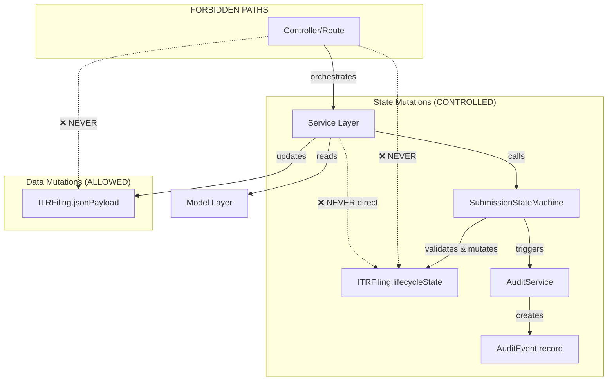

# Module Ownership & Mutation Rules
**S13 - System Visibility & Control Reset**  
**Last Updated:** 2026-01-04  
**Purpose:** Prevent regressions by defining WHO can mutate WHAT

---

## 🎯 Core Principle

> **Every critical field has exactly ONE owner service.**  
> All mutations MUST go through the owner service.  
> Direct model mutations are FORBIDDEN.

---

## 📋 Entity Ownership Matrix

### ITRFiling Entity

| Field | Owner Service | Can Mutate? | Read-Only Services | Notes |
|-------|--------------|-------------|-------------------|-------|
| **`lifecycleState`** | `SubmissionStateMachine` | ✅ ONLY via `.transition()` | All others | **CRITICAL:** Direct mutations logged as warnings |
| **`jsonPayload`** | Domain Services (Salary, CG, etc.) | ✅ Via specific services | `FilingService`, `TaxComputationEngine` | Contains all filing data (employers, deductions, etc.) |
| **`intelligenceFlags`** | `IntelligenceGateService` | ✅ | `CAReviewQueueService` | Auto-generated risk flags |
| **`intelligenceOverrides`** | `CAApprovalService` | ✅ | `IntelligenceGateService` | CA can override flags with justification |
| **`reviewedBy`** | `FilingReviewService` | ✅ | All others | Set when CA reviews |
| **`reviewedAt`** | `FilingReviewService` | ✅ | All others | Timestamp of review |
| **`reviewNotes`** | `FilingReviewService` | ✅ | All others | CA review comments |
| **`approvedBy`** | `CAApprovalService` | ✅ | All others | Set when CA approves |
| **`approvedAt`** | `CAApprovalService` | ✅ | All others | Timestamp of approval |
| **`approvalNotes`** | `CAApprovalService` | ✅ | All others | CA approval comments |
| **`assessmentYear`** | `FilingService` | ✅ At creation only | All others | Immutable after creation |
| **`taxpayerPan`** | `FilingService` | ✅ At creation only | All others | Immutable after creation |
| **`createdBy`** | `FilingService` | ✅ At creation only | All others | Immutable after creation |
| **`caFirmId`** | `FilingService` | ✅ At creation only | All others | Immutable after creation |

> [!CAUTION]
> **Violation Detection:** The `ITRFiling` model has a `beforeUpdate` hook that logs direct `lifecycleState` mutations with stack traces. If you see these warnings, you have a bug.

---

### AuditEvent Entity

| Field | Owner Service | Can Mutate? | Read-Only Services | Notes |
|-------|--------------|-------------|-------------------|-------|
| **ALL FIELDS** | `AuditService` | ✅ Create only | All others | **IMMUTABLE:** Updates and deletes throw fatal errors |

> [!IMPORTANT]
> **Audit Invariants:**
> - Audit events are **append-only** — no updates, no deletes
> - `beforeUpdate` hook throws: `"FATAL: Audit events are immutable"`
> - `beforeDestroy` hook throws: `"FATAL: Audit events are append-only"`
> - Audit failures MUST NOT block business operations (logged, not thrown)

---

### User Entity

| Field | Owner Service | Can Mutate? | Read-Only Services | Notes |
|-------|--------------|-------------|-------------------|-------|
| **`email`** | `AuthService` (not shown) | ✅ | All others | Auto-lowercased in hooks |
| **`passwordHash`** | `AuthService` | ✅ | None | Auto-hashed in hooks, never exposed in JSON |
| **`role`** | `AuthService` | ✅ | All others | ENUM: SUPER_ADMIN, CA, PREPARER, END_USER |
| **`caFirmId`** | `AuthService` | ✅ | All others | Links user to CA firm |
| **`status`** | `AuthService` | ✅ | All others | ENUM: active, disabled |
| **`fullName`** | `AuthService` | ✅ | All others | Display name |
| **`authProvider`** | `AuthService` | ✅ At creation only | All others | ENUM: local, google |

> [!WARNING]
> **Password Security:**
> - `passwordHash` is auto-hashed in `beforeCreate` and `beforeUpdate` hooks
> - `toJSON()` method strips `passwordHash` from serialized output
> - Virtual getter `hasPassword` indicates if user has local auth

---

## 🔐 Service Mutation Authority

### Ring 1: Core Filing Services

#### `FilingService`
**Can Mutate:**
- ✅ Create `ITRFiling` records
- ✅ Set immutable fields at creation (`assessmentYear`, `taxpayerPan`, `createdBy`, `caFirmId`)

**Cannot Mutate:**
- ❌ `lifecycleState` (must use `SubmissionStateMachine`)
- ❌ Review/approval fields (must use CA services)

**Responsibility:** Filing creation and read operations only

---

#### `SubmissionStateMachine`
**Can Mutate:**
- ✅ `ITRFiling.lifecycleState` ONLY via `.transition()` method

**Cannot Mutate:**
- ❌ Any other `ITRFiling` fields
- ❌ Direct database writes (returns mutated object, service layer saves)

**Responsibility:** State transition validation and enforcement

**Critical Rules:**
1. MUST validate transition is legal before mutating
2. MUST be called within a transaction
3. MUST be followed by `AuditService.logTransition()`

---

#### Domain Services (Salary, CG, Regime, etc.)
**Can Mutate:**
- ✅ `ITRFiling.jsonPayload` (specific sections only)

**Cannot Mutate:**
- ❌ `lifecycleState`
- ❌ Review/approval fields

**Examples:**
- `EmployerManagementService` → Updates `jsonPayload.employers[]`
- `CapitalGainsSummaryService` → Updates `jsonPayload.capitalGains[]`
- `TaxRegimeCalculator` → Updates `jsonPayload.regimeComparison`

---

### Ring 2: Trust & Review Services

#### `CAApprovalService`
**Can Mutate:**
- ✅ `ITRFiling.approvedBy`, `approvedAt`, `approvalNotes`
- ✅ `ITRFiling.intelligenceOverrides`
- ✅ Trigger state transitions via `SubmissionStateMachine`

**Cannot Mutate:**
- ❌ `lifecycleState` directly (must use `SubmissionStateMachine`)

**Responsibility:** CA approval workflow orchestration

---

#### `FilingReviewService`
**Can Mutate:**
- ✅ `ITRFiling.reviewedBy`, `reviewedAt`, `reviewNotes`

**Cannot Mutate:**
- ❌ `lifecycleState` directly (must use `SubmissionStateMachine`)

**Responsibility:** CA review workflow

---

#### `AuditService`
**Can Mutate:**
- ✅ Create `AuditEvent` records

**Cannot Mutate:**
- ❌ Update or delete `AuditEvent` records (immutable)
- ❌ Any `ITRFiling` fields

**Responsibility:** Audit trail creation

**Critical Rules:**
1. MUST NOT throw errors that block business operations
2. MUST log failures instead of propagating exceptions
3. MUST be called within the same transaction as the business operation

---

### Ring 3: External Services

#### `SubmissionWorker`
**Can Mutate:**
- ✅ Trigger state transitions via `SubmissionStateMachine`
  - `submitted_to_eri` → `eri_success`
  - `submitted_to_eri` → `eri_failed`

**Cannot Mutate:**
- ❌ `lifecycleState` directly

**Responsibility:** Async ERI submission and result handling

---

## 🚨 Violation Detection & Prevention

### Compile-Time Prevention
None (JavaScript is dynamic)

### Runtime Detection

#### 1. Model Hooks (ITRFiling)
```javascript
ITRFiling.beforeUpdate(async (filing) => {
  if (filing.changed('lifecycleState')) {
    enterpriseLogger.warn('Direct lifecycleState mutation detected', {
      filingId: filing.id,
      oldState: filing._previousDataValues.lifecycleState,
      newState: filing.lifecycleState,
      stack: new Error().stack,
    });
  }
});
```

**Action:** Check logs for `"Direct lifecycleState mutation detected"` warnings

---

#### 2. Model Hooks (AuditEvent)
```javascript
AuditEvent.beforeUpdate(() => {
  throw new Error('FATAL: Audit events are immutable - updates not allowed');
});

AuditEvent.beforeDestroy(() => {
  throw new Error('FATAL: Audit events are append-only - deletes not allowed');
});
```

**Action:** These will crash the application if violated — by design

---

### Code Review Checklist

When reviewing code changes, verify:

- [ ] Does this code mutate `ITRFiling.lifecycleState`?
  - ✅ If yes, does it use `SubmissionStateMachine.transition()`?
  - ❌ If no, reject the change

- [ ] Does this code mutate `AuditEvent` records?
  - ✅ If yes, is it creating new records via `AuditService`?
  - ❌ If updating/deleting, reject the change

- [ ] Does this code mutate `ITRFiling.jsonPayload`?
  - ✅ If yes, is it in a domain service (Salary, CG, etc.)?
  - ❌ If in a controller or route, reject the change

- [ ] Does this code mutate review/approval fields?
  - ✅ If yes, is it in `CAApprovalService` or `FilingReviewService`?
  - ❌ If elsewhere, reject the change

---

## 📊 Mutation Flow Diagram



---

## 🛠️ Developer Quick Reference

### I need to change filing state
```javascript
// ✅ CORRECT
const SubmissionStateMachine = require('../domain/SubmissionStateMachine');
const AuditService = require('../services/core/AuditService');

SubmissionStateMachine.transition(filing, 'approved');
await filing.save({ transaction });
await AuditService.logTransition(filingId, oldState, 'approved', userId, 'CA', transaction);

// ❌ WRONG
filing.lifecycleState = 'approved';
await filing.save();
```

### I need to add employer data
```javascript
// ✅ CORRECT
const EmployerManagementService = require('../services/itr/EmployerManagementService');
await EmployerManagementService.addEmployer(filingId, employerData);

// ❌ WRONG
filing.jsonPayload.employers.push(employerData);
await filing.save();
```

### I need to log an audit event
```javascript
// ✅ CORRECT
const AuditService = require('../services/core/AuditService');
await AuditService.logAuthEvent({
  actorId: userId,
  action: 'AUTH_LOGIN_SUCCESS',
  metadata: { ip, userAgent },
});

// ❌ WRONG
await AuditEvent.create({ ... });
```

---

## 🔍 Current Known Violations

### ✅ None Detected (Post-S12)

The S12 canonical migration eliminated all known violations:
- ✅ Removed `AuditLog` model (replaced with `AuditEvent`)
- ✅ Centralized state transitions in `SubmissionStateMachine`
- ✅ Removed direct state mutations from controllers
- ✅ Added runtime detection hooks

---

## 📍 Next Steps

1. **Add Runtime Tracing** (S13 Layer 3)
   - Log state transitions with structured metadata
   - Log auth events
   - Log filing creation

2. **Automated Violation Detection**
   - Add linting rules to detect direct model mutations
   - Add pre-commit hooks to check for violations

3. **Documentation**
   - Add JSDoc comments to services documenting mutation authority
   - Add inline comments to models documenting ownership

---

## 📚 Related Documents

- [SYSTEM_MAP.md](./SYSTEM_MAP.md) — Ring architecture and domain interactions
- [DEV_ENTRYPOINTS.md](./DEV_ENTRYPOINTS.md) — Flow-based navigation (coming next)
