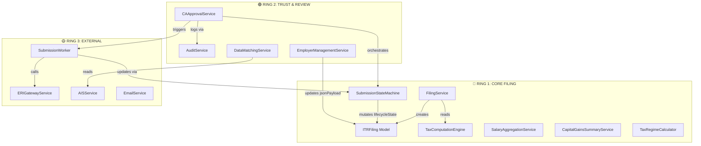

# BurnBlack System Architecture Map
**S13 - System Visibility & Control Reset**  
**Last Updated:** 2026-01-04  
**Purpose:** Runtime orientation for developers — understand the system in <30 seconds

---

## 🎯 Quick Reference

| Question | Answer |
|----------|--------|
| **Where does filing data live?** | `ITRFiling` model → `itr_filings` table |
| **Who controls state transitions?** | `SubmissionStateMachine` (Ring 1) |
| **What services mutate filing data?** | `FilingService`, `SubmissionStateMachine` only |
| **Where is audit logged?** | `AuditService` → `audit_events` table |
| **What's the submission flow?** | Draft → Review → Approved → ERI → Success/Failed |

---

## 🔵 Ring 1: CORE FILING (MUST NEVER BREAK)

**Critical Path:** User creates filing → Adds data → CA reviews → Submits to ITD

### Core Domain Models
- **`ITRFiling`** — Canonical filing entity
  - Owner: `FilingService`
  - State: Managed by `SubmissionStateMachine`
  - Fields: `lifecycleState`, `jsonPayload`, `assessmentYear`, `taxpayerPan`

- **`SubmissionStateMachine`** — State transition enforcer
  - Enforces legal state transitions
  - States: `draft` → `review_pending` → `reviewed` → `approved` → `submitted_to_eri` → `eri_success`/`eri_failed`
  - **NEVER bypass this** — all state changes MUST go through `.transition()`

### Core Services

#### Filing Orchestration
- **`FilingService`** (`services/core/FilingService.js`)
  - Creates new filings
  - Reads filing data with completion/safety status
  - Lists user filings
  - **Mutation Authority:** ✅ Can create, ❌ Cannot mutate state directly

#### State Management
- **`SubmissionStateMachine`** (`domain/SubmissionStateMachine.js`)
  - Validates state transitions
  - Mutates `lifecycleState` field
  - **Mutation Authority:** ✅ ONLY service that can change `lifecycleState`

#### Data Computation Services (Read-Only on Filing)
- **`SalaryAggregationService`** — Computes salary from employers
- **`CapitalGainsSummaryService`** — Aggregates CG transactions
- **`TaxRegimeCalculator`** — Old vs New regime comparison
- **`TaxComputationEngine`** — Final tax liability
- **`CompletionChecklistService`** — Filing readiness status
- **`FilingSafetyService`** — Safety warnings

> [!IMPORTANT]
> **Ring 1 Boundary Rule:** No external API calls. No side effects. Pure business logic only.

---

## 🟢 Ring 2: TRUST & REVIEW LAYER

**Purpose:** Human oversight, approval workflows, audit trails

### CA Review Workflow
- **`CAApprovalService`** (`services/ca/CAApprovalService.js`)
  - User submits to CA: `draft` → `review_pending`
  - CA approves: `review_pending` → `approved` → `submitted_to_eri`
  - Triggers background worker for ERI submission
  - **Mutation Authority:** ✅ Can trigger state transitions via `SubmissionStateMachine`

- **`FilingReviewService`** — CA review queue management
- **`CARequestInfoService`** — CA requests additional info from user
- **`IntelligenceGateService`** — Flags risky filings for review

### Audit & Compliance
- **`AuditService`** (`services/core/AuditService.js`)
  - Logs all state transitions
  - Logs auth events
  - Writes to `audit_events` table
  - **Mutation Authority:** ✅ Can create audit records, ❌ Cannot mutate filings

### Data Integrity Services
- **`EmployerManagementService`** — Manages employer data within filing
- **`DataMatchingService`** — Reconciles user input vs AIS data
- **`SourceTaggingService`** — Tracks data provenance

> [!WARNING]
> **Ring 2 Boundary Rule:** Can orchestrate Ring 1 services. Can call external APIs for verification (PAN, AIS). Cannot directly mutate `ITRFiling.lifecycleState`.

---

## 🟡 Ring 3: EXTERNAL SYSTEMS

**Purpose:** Integration with government systems, third-party services, async workers

### Government Integrations
- **`ERIGatewayService`** (`services/eri/ERIGatewayService.js`)
  - Submits XML to Income Tax Department
  - Handles DSC signing
  - Manages acknowledgment retrieval

- **`EVerificationService`** — E-verification via OTP/Aadhaar
- **`AISService`** — Annual Information Statement prefill
- **`Form26ASService`** — Tax credit statement

### Background Workers
- **`SubmissionWorker`** (`workers/SubmissionWorker.js`)
  - Async ERI submission
  - Handles retries on failure
  - Updates state to `eri_success` or `eri_failed`

### Supporting Services
- **`EmailService`** — Notifications
- **`S3Service`** — Document storage
- **`RedisService`** — Caching & session management
- **`JobQueue`** — Background job orchestration

> [!CAUTION]
> **Ring 3 Boundary Rule:** External calls can fail. Must be async. Must have retry logic. Must not block Ring 1/2 operations.

---

## 📊 Domain Interaction Map

---

## 🔐 Critical Invariants

### State Transition Rules
1. **ONLY** `SubmissionStateMachine.transition()` can change `lifecycleState`
2. All state changes MUST be audited via `AuditService`
3. State transitions MUST happen within database transactions

### Data Mutation Rules
1. **`ITRFiling.lifecycleState`** — Only `SubmissionStateMachine`
2. **`ITRFiling.jsonPayload`** — Only domain services (Salary, CG, etc.)
3. **`AuditEvent`** — Only `AuditService`
4. **`User`** — Only `AuthService` (not shown in map)

### Architectural Boundaries
1. **Ring 1 → Ring 2:** ✅ Allowed (Ring 2 orchestrates Ring 1)
2. **Ring 1 → Ring 3:** ❌ FORBIDDEN (Ring 1 must be pure)
3. **Ring 2 → Ring 3:** ✅ Allowed (Ring 2 can call external APIs)
4. **Ring 3 → Ring 1:** ✅ Via Ring 2 orchestration only

---

## 🚨 What Changed (S12 Canonical Migration)

### Before S12 (Legacy)
- Multiple state fields: `status`, `submissionStatus`, `lifecycleState`
- `AuditLog` model (flat, unstructured)
- Direct state mutations in controllers
- Distributed filing logic across routes

### After S12 (Canonical)
- **Single source of truth:** `lifecycleState` only
- **Canonical audit:** `AuditEvent` model with structured metadata
- **Centralized state machine:** All transitions via `SubmissionStateMachine`
- **Orchestrated filing:** `FilingService` coordinates all operations

---

## 🛠️ Developer Quick Start

### I need to add a new income source
1. Create service in `services/itr/` (Ring 1)
2. Service updates `ITRFiling.jsonPayload` only
3. Do NOT touch `lifecycleState`
4. Add to `CompletionChecklistService` if required

### I need to add a new state
1. Add to `domain/SubmissionStates.js`
2. Update `TRANSITIONS` graph in `SubmissionStateMachine.js`
3. Update database enum: `ALTER TYPE lifecycle_state_enum ADD VALUE 'new_state'`
4. Add audit logging for new transition

### I need to integrate a new external API
1. Create service in `services/integration/` (Ring 3)
2. Call from Ring 2 service (e.g., `CAApprovalService`)
3. Add error handling and retries
4. Do NOT call directly from Ring 1

---

## 📍 Next Steps After S13

- **F1 Phase 2:** Resume salary addition feature
- **ERI Integration:** Complete async submission pipeline
- **V5 Truth Test:** End-to-end filing verification
- **Monitoring:** Add runtime tracing (Layer 3 of S13)
